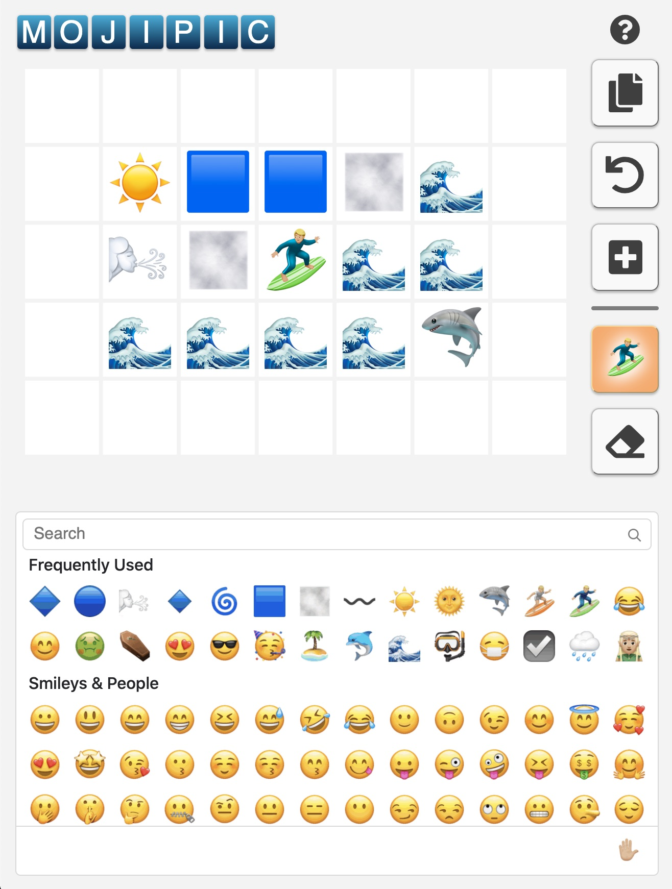

# MojiPic

[mojipic.app](https://mojipic.app/)

An app for making emoji pics.

> ☁️☁️☁️🌈🌈  
> ☁️🌦️🌈👺☘️  
> 🌧️🌈🌳☘️☘️  
> 🌈🍀☘️🌳🦌  
> 💰🧝🏼🌳🌳🌳  




## Setup

```
yarn
```

## Run

```
yarn start
```

## Test

```
yarn test
```

## Design notes

The logic for the drawing canvas is in [drawing.ts](web/src/lib/emoji-drawing/drawing.ts).
The class is treated as immutable. Operations on the drawing return a new object, 
so they can be used for React state updates.

Some experimentation with reactive state stores is done in [lib/reactives](web/src/lib/reactives).
